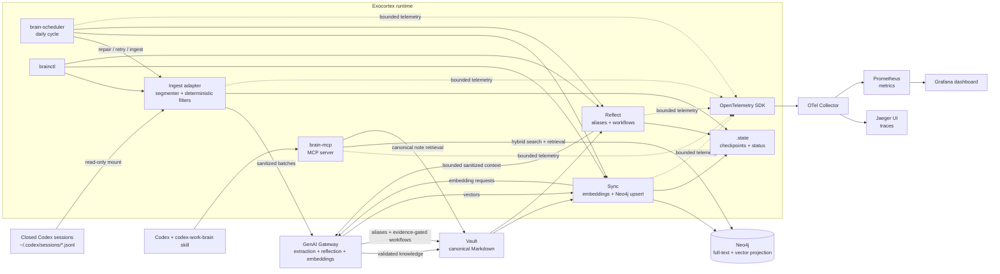

# Exocortex

Exocortex is the local work knowledge system for Codex. Canonical Markdown
notes live in the Vault, while Neo4j provides a rebuildable graph and retrieval
index. The MCP server is available only on the work PC loopback interface.

This repository contains work data and configuration only. A future personal
deployment must be a separate repository copy on the personal server, with no
shared Vault, Neo4j database, credentials, gateway, MCP registration, or backup.
The local stack can export OpenTelemetry traces and metrics without including
prompts, note contents, gateway response bodies, or credentials. Observability
is disabled by default in `.env.example` and can be enabled with the
`observability` Compose profile.

## Architecture

The following diagram shows the end-to-end flow. It is included as Mermaid so it
can be rendered by repository viewers that support diagrams-as-code.

The observability branch is shown separately because it is operational data,
not knowledge: it helps explain latency, gateway failures, ingestion volume,
sync throughput, and reflection activity without becoming part of the Vault.

The Vault is the canonical source of knowledge. Neo4j is a rebuildable
projection used for full-text, vector, and graph-assisted retrieval. The
`.state` directory stores operational metadata such as content-hash checkpoints,
index progress, reflection progress, and scheduler status. Brain does not copy
raw rollout files or persist raw gateway responses; only sanitized and
validated/marked results are retained.

The scheduler cycle runs repair, an optional fallback retry guarded by an
extraction canary, incremental ingestion of closed sessions, sync, and
reflection. Reflection may produce aliases without producing workflows. Workflow
evidence still requires a confirmed success or decision, supported claims, and
no contradictions. `assistant_suggestion` claims can become eligible when
positive evidence repeats across at least two independent sessions; a lone
suggestion remains blocked. New workflows start with continuous confidence:
single-session candidates are capped at 0.65, scores from 0.50 to 0.79 require
confirmation, and scores from 0.80 can be applied automatically. Feedback
changes confidence by +0.15 for approval or success and -0.20 for rejection or
failure; scores below 0.30 are quarantined.

## Setup

Start the complete local stack with one command:

~~~
./scripts/start.sh
~~~

On the first run it creates the Python environment, writes <code>.env</code>
from the active Codex gateway configuration, generates a local Neo4j password,
starts Colima when available, and then starts Docker Compose.

Register the local MCP and skill once with:

~~~
./scripts/start.sh --install-codex
~~~

Restart Codex after that registration. For manual setup, run the following from
the repository root.

The registration grants automatic approval only to <code>brain_remember</code>.
It stores sanitized work memories directly in the canonical Vault.

~~~
cd /path/to/exocortex
python3 -m venv .venv
.venv/bin/pip install -e '.[dev]'
.venv/bin/brainctl config init --from-codex
~~~

The gateway URL is read from the current Codex configuration, without copying
its credentials.

Start Colima if Docker is not already running, then start the stack.

~~~
colima start
make up
make doctor
~~~

The work MCP server listens only on
<code>http://127.0.0.1:8765/mcp</code>. Open
<code>brain/Vault</code> with Obsidian when a visual editor is useful.
When the `observability` profile is enabled, the local observability interfaces
are Jaeger at
<code>http://127.0.0.1:16686</code>, Grafana at
<code>http://127.0.0.1:3000</code>, and Prometheus at
<code>http://127.0.0.1:9090</code>.

By default, the scheduler runs the learning cycle at 03:00 in
<code>America/Argentina/Buenos_Aires</code>. The hour and timezone are
configurable with <code>BRAIN_REFLECTION_HOUR</code> and
<code>BRAIN_TIMEZONE</code>. It reads closed Codex sessions from
<code>~/.codex/sessions</code> through a read-only container mount, creates
sanitized thematic experiences, assigns canonical labels, and consolidates
verified repeated work into workflows. Claims retain only bounded sanitized
evidence. Brain does not copy raw rollout files into its persistent data
directory. Daily ingestion is bounded by
<code>BRAIN_INGEST_MAX_LLM_CALLS</code> (default 50),
<code>BRAIN_INGEST_MAX_SECONDS</code> (default 1800), and
<code>BRAIN_INGEST_BATCH_SIZE</code> (default 5). A stopped cycle resumes from
per-segment content-hash checkpoints. Sync also batches embedding requests with
<code>BRAIN_EMBEDDING_BATCH_SIZE</code> (default 50) and Neo4j upserts with
<code>BRAIN_NEO4J_UPSERT_BATCH_SIZE</code> (default 100). Historical backfill is
a separate manual operation; set
<code>BRAIN_SCHEDULER_BACKFILL_ENABLED=true</code> only for a controlled
maintenance window. Fallback retry is controlled by
<code>BRAIN_SCHEDULER_FALLBACK_RETRY_ENABLED</code> (default true), and each
reflection cycle considers at most <code>BRAIN_REFLECTION_MAX_NOTES</code>
(default 50) notes. Historical reflection context is expanded through an OR
union of labels, lexical terms, claim keys, and optional Neo4j vector matches;
disable the vector signal with
<code>BRAIN_REFLECTION_SEMANTIC_ENABLED=false</code> if the embedding index is
unavailable. Evidence validation remains unchanged.

Each gateway request has a total wall-clock budget configured with
<code>BRAIN_GATEWAY_WALL_TIMEOUT_SECONDS</code> (default 120), including any
retry delay. The extraction canary uses the shorter
<code>BRAIN_CANARY_TIMEOUT_SECONDS</code> budget (default 30). OpenTelemetry
adds one <code>exocortex.gateway.request</code> span per attempt with the
bounded timeout, elapsed wall/monotonic durations, HTTP status, retryability,
and deadline-exceeded fields.

Workflow recommendation has a separate optional operational context. Set
<code>BRAIN_OPERATIONAL_CONTEXT_ENABLED=true</code> and configure the comma-
separated <code>BRAIN_OPERATIONAL_ROLE</code>,
<code>BRAIN_OPERATIONAL_DOMAINS</code>,
<code>BRAIN_OPERATIONAL_COMMON_TASKS</code>,
<code>BRAIN_OPERATIONAL_PREFERRED_TOOLS</code>, and
<code>BRAIN_OPERATIONAL_LOW_PRIORITY</code> values. This context only ranks
eligible workflows and exposes separate evidence, quality, relevance,
actionability, specificity, and genericness scores. A weak contextual match is
marked <code>deprioritize</code>; it never creates a workflow or overrides the
evidence gate. When disabled, existing confidence-based recommendation levels
remain unchanged. See <code>.env.example</code> for a platform-engineering
example.

Workflow discovery is action-centered. Extracted experiences may identify a
normalized action such as <code>iam.grant_access</code>, its subjects and
objects, the tool or MCP used, and the observed outcome. Reflection can then
associate one or more implementation paths with that action. A single known
path remains a valid workflow; distinct tools or routes are preserved as
separate alternatives instead of being deduplicated by similar titles.

Search uses an asymmetric trust policy: ingestion preserves sanitized notes
even when their evidence is proposed, incomplete, or contradictory; output is
more conservative. <code>brain_search</code> defaults to
<code>answer_mode=conservative</code>, verifies canonical notes, and separates
direct evidence from <code>context_only</code> results. Use
<code>answer_mode=exploration</code> (or
<code>include_candidates=true</code>) to expose broader related candidates.
Search results include <code>claim_support</code> values of
<code>direct</code>, <code>context_only</code>, <code>contradictory</code>, or
<code>unknown</code>; context does not prove that an action occurred. Explicit
repository and project filters are hard constraints, while low-confidence
inferred scope remains a ranking signal. Relevance can be recorded through
<code>brain_record_search_feedback</code>.
When a scoped query has no supporting evidence, the response abstains with
<code>no_evidence_for_scope</code>; other abstentions also expose an explicit
reason rather than returning a null diagnostic.
Technical entity/object queries also use a literal Vault fallback when the
rebuildable graph projection misses a note; recovered material remains
<code>context_only</code> unless action evidence is present.
Notes with metadata but empty canonical content are returned by
<code>brain_get</code> as <code>status=incomplete</code> and are never promoted
to searchable evidence.
Feedback may also include <code>scope_mismatch</code>,
<code>too_specific</code>, <code>overgeneralized</code>,
<code>wrong_provider</code>, <code>wrong_runtime</code>,
<code>useful_example</code>, or <code>useful_pattern</code> tags.

Knowledge is also modeled at two levels: a reusable <code>pattern</code> and a
scoped <code>adapter</code>, <code>example</code>, or <code>decision</code>. Notes
may carry structured scope for organization, provider, runtime, region,
authentication, environment, project, repository, and role. Generic queries
prefer patterns; explicit context promotes matching adapters without hiding
the general answer. The local vocabulary maps <code>acme</code> to the
organization <code>Acme Corp</code>, not to a region. This scope is a
ranking and explanation signal unless the user supplied a hard filter.
When no matching pattern exists, a generic query can return a strongly matching
adapter or example and reports its abstraction in
<code>meta.fallback_abstraction</code>.
Reflection can derive a pattern note only when at least two independent scoped
implementations share the same <code>pattern_key</code>. The derived note keeps
source references, uses <code>evidence_status=investigation</code>, and never
claims that an implementation was executed. A single provider-specific note
remains an example or adapter until more evidence converges.

<code>brain_remember</code> uses the same structured extraction path as normal
ingestion, preserves the sanitized source content, and indexes the note before
reporting success. Its response includes the extracted
<code>knowledge_level</code>, <code>pattern_key</code>, and
<code>consolidation_pending</code>. If Vault persistence succeeds but indexing
is unavailable, it returns <code>status=degraded</code> with
<code>index_pending=true</code>; the regular sync cycle can retry the missing
projection.

To ingest local Codex sessions, mount the sessions directory read-only for the
one command. The raw rollout files remain outside the stack; only sanitized
material is retained. The date encoded in the Codex session path is retained as
source metadata, so date-range questions remain grounded in the original
conversation date. <code>brain_list_by_date</code> reports that its date basis is
<code>source_reference.occurred_on</code> and includes coverage diagnostics when
source dates are missing or differ from note ingestion dates. It supports
backward-compatible offset pagination and reports <code>total_count</code>,
<code>has_more</code>, and <code>next_offset</code>; the timeline CLI exposes the
same metadata.

Ingestion status distinguishes <code>ingested</code>, <code>pending</code>,
<code>failed</code>, and <code>not_available</code> sessions. A missing mounted
session source is reported as unavailable rather than as a completed empty
run, and failed sessions remain retryable.

~~~
docker-compose --env-file .env run --rm \
  -v /Users/your-user/.codex/sessions:/sources/codex:ro \
  brain brainctl ingest-codex --sessions-root /sources/codex --space work
~~~

## Codex Integration

The reusable skill source lives in
<code>integrations/codex/codex-work-brain</code>. The installer copies it to the
current user's skill directory and registers the MCP server. Restart Codex after
installing it.

For a local work deployment:

~~~
.venv/bin/brainctl config install-codex
~~~

The MCP exposes read-only search, note retrieval, health, and write tools that
store sanitized memories or search relevance feedback. It also exposes label
lookup, workflow recommendation, workflow retrieval, and learning status.

### Claude Code Integration

Claude Code can use the same local Streamable HTTP MCP server and the same
harness-neutral work skill. Install it globally for the current user with:

~~~
cd /path/to/exocortex
.venv/bin/brainctl config install-claude
~~~

The command registers `http://127.0.0.1:8765/mcp` with Claude Code at user
scope, installs `codex-work-brain` in `~/.claude/skills`, and allows the
`brain_remember` MCP tool to store explicitly requested sanitized memories
without a second permission prompt. It is idempotent and refuses to replace an
existing `exocortex` registration that points to another URL.

Verify the registration with:

~~~
claude mcp get exocortex
claude mcp list
~~~

Restart Claude Code after installation so it loads the skill. Codex and Claude
share the same local Vault, Neo4j projection, MCP endpoint, and observability
stack; no second ingestion or database is created.

### Google Antigravity Integration

Google Antigravity connects to Exocortex via its native Model Context Protocol (MCP) and Skills architecture.

Install the skill and register the MCP server for Antigravity with:

~~~
exocortexctl config install-antigravity
~~~

This command:
1. Installs the `exocortex` skill to `~/.gemini/config/skills/exocortex/SKILL.md`.
2. Registers `http://127.0.0.1:8765/mcp` as an active MCP server in `~/.gemini/config/mcp_config.json`.

To ingest Antigravity session transcripts with bounded, resumable extraction:

~~~
exocortexctl ingest-antigravity --transcripts-root ~/.gemini/antigravity/brain --space work
~~~

All coding assistants (Antigravity, Codex, Claude Code) share the same local Vault, Neo4j projection, and MCP endpoint.

## Operations

Run commands inside the Brain container after the stack is up.

~~~
docker-compose --env-file .env exec brain brainctl doctor
docker-compose --env-file .env exec brain brainctl search "Dataform Scheduler"
docker-compose --env-file .env exec brain brainctl list-by-label topic:cicd
docker-compose --env-file .env exec brain brainctl ingest-status
docker-compose --env-file .env exec brain brainctl learning-status
docker-compose --env-file .env exec brain brainctl extraction-canary
docker-compose --env-file .env exec brain brainctl reflect
docker-compose --env-file .env exec brain brainctl timeline --from 2026-07-27 --to 2026-08-02
docker-compose --env-file .env exec brain brainctl sync
docker-compose --env-file .env exec brain brainctl repair report
docker-compose --env-file .env exec brain brainctl backfill --all --batch-size 25 --max-failures 25
docker-compose --env-file .env exec brain brainctl retry-fallbacks --batch-size 25
docker-compose --env-file .env run --rm \
  -v /Users/your-user/.codex/sessions:/sources/codex:ro \
  brain brainctl ingest-codex --sessions-root /sources/codex \
  --max-llm-calls 10 --max-seconds 600 --batch-size 5
docker-compose --env-file .env exec brain brainctl eval
docker-compose --env-file .env exec brain brainctl audit
docker-compose --env-file .env exec brain brainctl export
~~~

Follow the scheduler and inspect persisted progress with:

~~~
docker-compose --env-file .env logs -f scheduler
docker-compose --env-file .env exec brain brainctl ingest-status
docker-compose --env-file .env exec brain brainctl learning-status
~~~

Inspect OpenTelemetry with:

~~~
COMPOSE_PROFILES=observability docker-compose --env-file .env up -d
docker-compose --env-file .env logs -f otel-collector
docker-compose --env-file .env ps jaeger otel-collector prometheus grafana
open http://127.0.0.1:16686
open http://127.0.0.1:3000
~~~

The default Grafana dashboard is named `Exocortex - OpenTelemetry`. It shows
gateway request rate and p95 latency, ingest outcomes, LLM call throughput, and
sync/reflection throughput. Jaeger shows the parent operation spans for MCP,
ingest, sync, reflect, and the gateway calls beneath them. To disable the
stack, remove `observability` from `COMPOSE_PROFILES`, set
`BRAIN_OTEL_ENABLED=false`, and recreate the containers. The Brain continues
running without exporters.

The main diagnostic files are
<code>brain/.state/learning-status.json</code> (phase, timestamps, and reasons),
<code>brain/.state/codex-ingest-checkpoint.json</code> (session and segment
progress), <code>brain/.state/index-state.json</code> (sync state), and
<code>brain/.state/reflection-state.json</code> (notes already considered by
reflection). The scheduler lock is
<code>brain/.state/learning-cycle.lock</code>; it is normally removed by the
process when the cycle exits. If the container is terminated abruptly, verify
that the scheduler is stopped before removing a stale lock.

<code>brainctl rebuild</code> deletes and recreates only the Neo4j projection
from the canonical Vault. Use it as a recovery command, never as daily
maintenance.

## Verification

~~~
.venv/bin/ruff check src tests
.venv/bin/pytest
docker-compose --env-file .env config
~~~

The automated tests cover deterministic sanitization, high-confidence secret
audits, canonical-note merge behavior, idempotent ingestion, bounded thematic
session windows, claims and evidence validation, canonical labels and aliases,
hybrid ranking, evidence-gated reflection, repair/backfill, automatic memory
storage, gateway request contracts, and the local Codex rollout adapter.
GitLab CI runs the Ruff lint job followed by the pytest job for pushes and merge
requests.
MCP and JSON CLI responses use schema version 2 with an envelope containing
<code>status</code>, <code>method</code>, <code>data</code>, and non-sensitive
<code>meta</code>. Search can explicitly abstain or degrade when evidence or
indexes are insufficient.

The frozen golden set lives in <code>evals/golden-v1.jsonl</code>. Run it offline
with <code>make quality</code> or against live indexes with
<code>make quality-live</code>.
Running Docker integration checks requires a running Docker daemon and a
configured gateway.

## Assumptions

- The work gateway remains available from the Docker host at its configured
  local URL.
- Docker is available on the work PC.
- Weak and legacy memories remain searchable with a penalty. Workflow
  recommendations require supported user-decision or tool-observation claims,
  and recommendation feedback is persisted in the Vault before being projected
  to Neo4j.

## Roadmap & Architecture RFCs

- **[RFC 001: Centralized Multi-User Architecture & Label-First Knowledge Graph](docs/rfcs/001-multiuser-label-based-architecture.md)**:
  Evolution of Exocortex from a local workstation tool into a centralized team knowledge service accessed exclusively over MCP, featuring a unified label-based taxonomy (replacing rigid space silos) and automatic background user role profiling (DevOps, Data Eng, SRE).
